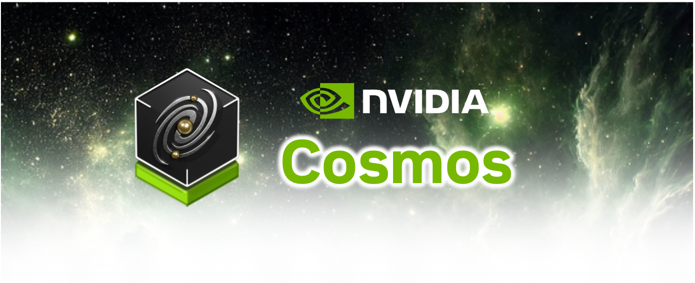
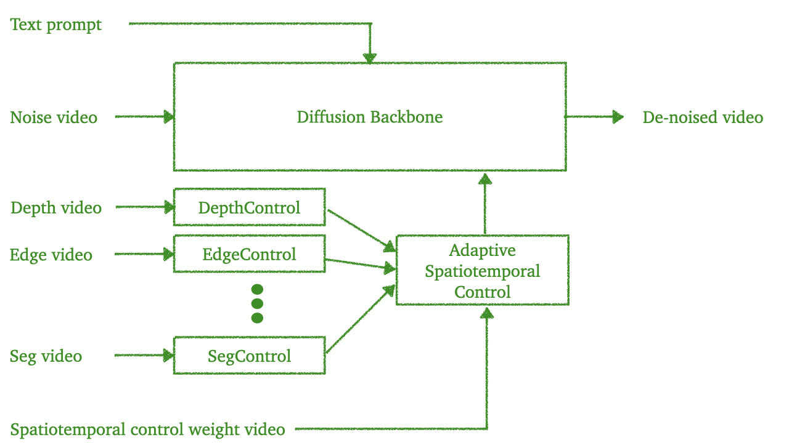

    

### [Product Website](https://www.nvidia.com/en-us/ai/cosmos/) | [Hugging Face](https://huggingface.co/collections/nvidia/cosmos-transfer1-67c9d328196453be6e568d3e) | [Paper](https://arxiv.org/abs/2503.14492) | [Paper Website](https://research.nvidia.com/labs/dir/cosmos-transfer1/)

Cosmos-Transfer1 is a key branch of Cosmos World Foundation Models (WFMs) specialized for multimodal controllable conditional world generation or world2world transfer. The three main branches of Cosmos WFMs are [cosmos-predict](https://github.com/nvidia-cosmos/cosmos-predict1), [cosmos-transfer](https://github.com/nvidia-cosmos/cosmos-transfer1), and [cosmos-reason](https://github.com/nvidia-cosmos/cosmos-reason1). We visualize the architecture of Cosmos-Transfer1 in the following figure.

    

Cosmos-Transfer1 includes the following:
- **ControlNet-based single modality conditional world generation** where a user can generate visual simulation based on one of the following modalities: segmentation video, depth video, edge video, blur video, LiDAR video, or HDMap video. Cosmos-Transfer1 generates a video based on the signal modality conditional input, a user text prompt, and, optionally, an input RGB video frame prompt (which could be from the last video generation result when operating in the autoregressive setting). We will use Cosmos-Transfer1-7B [Modality] to refer to the model operating in this setting. For example, Cosmos-Transfer1-7B [Depth] refers to a depth ControlNet model.
- **MultiControlNet-based multimodal conditional world generation** where a user can generate visual simulation based on any combination of segmentation video, depth video, edge video, and blur video (LiDAR video and HDMap in the AV sample) with a spatiotemporal control map to control the stregnth of each modality across space and time. Cosmos-Transfer1 generates a video based on the multimodal conditional inputs, a user text prompt, and, optionally, an input RGB video frame prompt (This could be from the last video generation result when operating in the autoregressive setting.). This is the preferred mode of Cosmos-Transfer. We will refer it as Cosmos-Transfer1-7B.
- **4KUpscaler** for upscaling a 720p-resolution video to a 4K-resolution video.
- **Post-training scripts** for helping Physical AI builders post-train pre-trained Cosmos-Transfer1 for their applications.
- **Pre-training scripts** for helping Physical AI builders train their own Cosmos-Transfer1 models from scratch.

## News
- [2025/05] **Cosmos AV Single2MultiView** is available! Now you can create dynamic, multi-view clips from just one video. Try it out and tell us what you think!  
    - [Inference guide](examples/inference_cosmos_transfer1_7b_sample_av_single2multiview.md)  
    - [Build your own or PyTorch post-training](examples/training_cosmos_transfer_7B_sample_AV.md)  

    - [Hugging Face model](https://huggingface.co/nvidia/Cosmos-Transfer1-7B-Sample-AV-Single2MultiView)

- [2025/04] [Post training](README.md#post-train-pre-trained-cosmos-transfer1-models) is available! Now you can customize Transfer1 models in your own way. Please try it out and we look forward to your feedback.

## Example Model Behavior

[Cosmos-Transfer LiDAR + HDMap Conditional Inputs -> World](https://github.com/nvidia-cosmos/cosmos-transfer1)

<video src="https://github.com/user-attachments/assets/169cf5c5-de59-44db-b1bf-19fb57cb7e2e">
  Your browser does not support the video tag.
</video>

[Cosmos-Transfer Multimodal Conditional Inputs -> World](https://github.com/nvidia-cosmos/cosmos-transfer1)

<video src="https://github.com/user-attachments/assets/4c1da01f-c3fd-4b6c-b084-f5ef653abb80">
  Your browser does not support the video tag.
</video>

## Getting Started

We provide a comphrehensive set of examples to illustrate how to perform inference, post-training, etc, with Cosmos-Transfer1. Click a relevant example below and start your Cosmos journey.

### Installation

Please refer to [INSTALL.md](INSTALL.md) for general instructions on environment setup.

### Inference with pre-trained Cosmos-Transfer1 models

* [Inference with pre-trained Cosmos-Transfer1-7B](/examples/inference_cosmos_transfer1_7b.md) **[with multi-GPU support]**
* [Inference with pre-trained Cosmos-Transfer1-7B-Sample-AV](/examples/inference_cosmos_transfer1_7b_sample_av.md) **[with multi-GPU support]**
* [Inference with pre-trained Cosmos-Transfer1-7B-4KUpscaler](/examples/inference_cosmos_transfer1_7b_4kupscaler.md) **[with multi-GPU support]**
* [Inference with pre-trained Cosmos-Transfer1-7B (Depth)](examples/inference_cosmos_transfer1_7b_depth.md)
* [Inference with pre-trained Cosmos-Transfer1-7B (Segmentation)](examples/inference_cosmos_transfer1_7b_seg.md)
* [Inference with pre-trained Cosmos-Transfer1-7B (Edge)](examples/inference_cosmos_transfer1_7b.md#example-1-single-control-edge)
* [Inference with pre-trained Cosmos-Transfer1-7B (Vis)](examples/inference_cosmos_transfer1_7b_vis.md)
* [Inference with pre-trained Cosmos-Transfer1pt1-7B [Keypoint]](/examples/inference_cosmos_transfer1pt1_7b_keypoint.md)
* [Inference with pre-trained Cosmos-Transfer1-7B-Sample-AV-Multiview](/examples/inference_cosmos_transfer1_7b_sample_av_single2multiview.md)

### Post-train pre-trained Cosmos-Transfer1 models

* [Post-train pre-trained Cosmos-Transfer1-7B [Depth | Edge | Keypoint | Segmentation | Vis]](examples/training_cosmos_transfer_7b.md) **[with multi-GPU support]**
* [Post-train pre-trained Cosmos-Transfer1-7B-Sample-AV [LiDAR|HDMap]](examples/training_cosmos_transfer_7B_sample_AV.md) **[with multi-GPU support]**
* [Post-train pre-trained Cosmos-Transfer1-7B-Sample-AV-Multiview[LiDAR|HDMap]](examples/training_cosmos_transfer_7B_sample_AV.md) **[with multi-GPU support]**

### Build your own Cosmos-Transfer1 models from scratch

* [Pre-train Cosmos-Transfer1-7B [Depth | Edge | Keypoint | Segmentation | Vis]](examples/training_cosmos_transfer_7b.md) **[with multi-GPU support]**
* [Pre-train Cosmos-Transfer1-7B-Sample-AV [LiDAR|HDMap]](examples/training_cosmos_transfer_7B_sample_AV.md) **[with multi-GPU support]**
* [Pre-train Cosmos-Transfer1-7B-Sample-AV-Multiview[LiDAR|HDMap]](examples/training_cosmos_transfer_7B_sample_AV.md) **[with multi-GPU support]**

### Workflow

*[Robotics Augmentation Workflow](/cosmos_transfer1/auxiliary/robot_augmentation/README.md): Scene augmentation for robotic manipulation, mapping one robotics synthetic example to multiple realistic examples

<video src="https://github.com/user-attachments/assets/6dee15f5-9d8b-469a-a92a-3419cb466d44">
  Your browser does not support the video tag.
</video>

## Cosmos-Transfer1 Models

* [Cosmos-Transfer1-7B](https://huggingface.co/nvidia/Cosmos-Transfer1-7B): multimodal controllable conditional world generation with adaptive spatiotemporal control map. The supported modalities include segmentation, depth, canny edge, and blur visual.
* [Cosmos-Transfer1-7B [Depth | Edge | Keypoint | Segmentation | Vis]](https://huggingface.co/nvidia/Cosmos-Transfer1-7B): single modality controllable conditional world generation. This refers to Cosmos-Transfer1-7B operates on the single modality case and is reduced to a ControlNet.
* [Cosmos-Transfer1-7B-Sample-AV](https://huggingface.co/nvidia/Cosmos-Transfer1-7B-Sample-AV): multimodal controllable conditional world generation with adaptive spatiotemporal control map specialized for autonomous vehicle applications. The supported modalities include LiDAR and HDMap.
* [Cosmos-Transfer1-7B [LiDAR | HDMap]](https://huggingface.co/nvidia/Cosmos-Transfer1-7B-Sample-AV): single modality controllable conditional world generation for autonomous vehicle applications. This refers to Cosmos-Transfer1-7B-Sample-AV operates on the single modality case and is reduced to a ControlNet.
* [Cosmos-Transfer1-7B-4KUpscaler](https://huggingface.co/nvidia/Cosmos-Transfer1-7B-4KUpscaler): 4K upscaler to super-resolute 720p videos to 4K videos.

## License and Contact

This project will download and install additional third-party open source software projects. Review the license terms of these open source projects before use.

This model includes safety and content moderation features powered by Llama Guard 3. Llama Guard 3 is used solely as a content input filter and is subject to its own license.

NVIDIA Cosmos source code is released under the [Apache 2 License](https://www.apache.org/licenses/LICENSE-2.0).

NVIDIA Cosmos models are released under the [NVIDIA Open Model License](https://www.nvidia.com/en-us/agreements/enterprise-software/nvidia-open-model-license). For a custom license, please contact [cosmos-license@nvidia.com](mailto:cosmos-license@nvidia.com).
